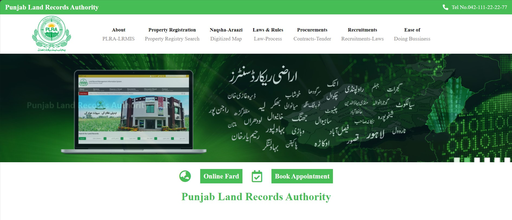

# PLRA - Punjab Land Records Authority Website

Welcome to the Punjab Land Records Authority (PLRA) Website repository! This project is a responsive and user-friendly website designed to facilitate easy access to land records in Punjab, Pakistan.



## Introduction

PLRA aims to streamline the process of accessing land records by providing an intuitive and accessible online platform. The website is built with a focus on user experience, ensuring a seamless navigation experience for users from diverse backgrounds.

## Features

- **Responsive Design:** The website is optimized for various devices, including desktops, tablets, and mobile phones, ensuring a consistent user experience across different screen sizes.
- **Search Functionality:** Users can easily search for land records using different parameters such as location, owner name, or property ID, making it convenient to find relevant information.
- **Interactive Maps:** Integration of interactive maps allows users to visualize land parcels and obtain detailed information about specific areas, enhancing spatial understanding.
- **Secure Authentication:** Secure user authentication ensures data privacy and access control for authorized users such as government officials and property owners, maintaining confidentiality.
- **Multi-language Support:** The website supports multiple languages to cater to a diverse user base, ensuring accessibility and inclusivity for all users.
- **Customizable Dashboard:** Personalized dashboards enable users to customize their experience and access relevant information quickly, improving user satisfaction.

## Getting Started

To get started with PLRA, follow these steps:

1. Clone the repository:

   ```bash
   git clone https://github.com/iMamoonAkhter/PLRA_Website.git
